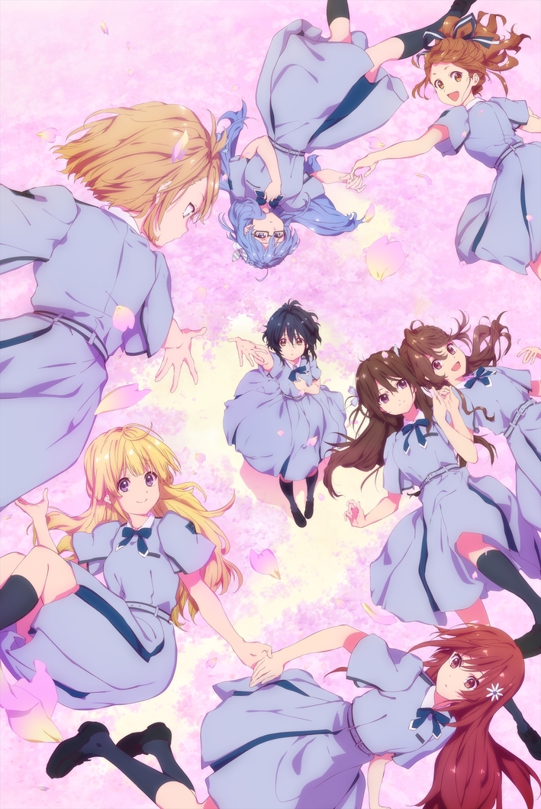

# TV动画《22/7》

!!! general inline end "动画信息"

    

    --------

    <b>作品名称:</b> 22/7

    --------

    <b>作品类型:</b> TV动画

    --------

    <b>播出时间:</b> 2020年1月－3月

    --------

    <b>集数:</b> 正篇12集＋番外篇1集

    --------

    <b>导演:</b> 阿保孝雄

    --------

    <b>动画制作:</b> A-1 Pictures

    --------

    <b>制作:</b> ANIME 22/7

## 简介

TV动画《22/7》于2020年1月至3月播出，以滝川みう等八名角色收到艺能事务所G.I.P.的邀请为开端，讲述她们相遇并组成22/7的“起始故事”。

正篇共12集。未放送的番外篇第13集「8＋3＝？」收录于Blu-ray＆DVD Vol.6，并补充了神木みかみ、東条悠希与柊つぼみ三名角色的故事。

## 集数

| 集数 | 标题 | 官方介绍 |
| --- | --- | --- |
| 01 | さよなら、私のささやかな世界 | [STORY](https://227anime.com/story/?id=ep01) |
| 02 | めまいの真ん中 | [STORY](https://227anime.com/story/?id=ep02) |
| 03 | こんにちは、新しい世界 | [STORY](https://227anime.com/story/?id=ep03) |
| 04 | 約束に咲く花 | [STORY](https://227anime.com/story/?id=ep04) |
| 05 | ひっくり返せばええねんで！ | [STORY](https://227anime.com/story/?id=ep05) |
| 06 | 偶数と奇数のあいだ | [STORY](https://227anime.com/story/?id=ep06) |
| 07 | ハッピー☆ジェット☆コースター | [STORY](https://227anime.com/story/?id=ep07) |
| 08 | ゆめみるロボット | [STORY](https://227anime.com/story/?id=ep08) |
| 09 | お星さまのララバイ | [STORY](https://227anime.com/story/?id=ep09) |
| 10 | さよなら、私たちの世界 | [STORY](https://227anime.com/story/?id=ep10) |
| 11 | ただその背中を追いつづけて | [STORY](https://227anime.com/story/?id=ep11) |
| 12 | ナナブンノニジュウニ | [STORY](https://227anime.com/story/?id=ep12) |
| 13 | ８＋３＝？ | [STORY](https://227anime.com/story/?id=ep13) |

## 音乐

| 用途 | 歌曲 |
| --- | --- |
| 片头曲 | [:pack-hires: ムズイ](../songs/single/5th/song-1.md) |
| 片尾曲 | [:pack-hires: 空のエメラルド](../songs/single/5th/song-2.md) |

部分话数使用了对应角色的角色曲作为片尾曲。

| 集数 | 歌曲 |
| --- | --- |
| 03 | [:pack-hires: One of them](../songs/character/song-1.md) |
| 04 | [:pack-hires: 生きることに楽になりたい](../songs/character/song-2.md) |
| 05 | [:pack-hires: 夢の船](../songs/character/song-3.md) |
| 06 | [:pack-hires: 優等生じゃつまらない](../songs/character/song-4.md) |
| 07 | [:pack-hires: 人生はワルツ](../songs/character/song-5.md) |
| 08 | [:pack-hires: 感情無用論](../songs/character/song-6.md) |
| 09 | [:pack-hires: Moonlight](../songs/character/song-7.md) |
| 11 | [:pack-hires: 孤独は嫌いじゃない](../songs/character/song-8.md) |
| 13 | [:pack-hires: 神様に指を差された僕たち](../songs/character/song-9.md) |

## 制作人员

| 职务 | 姓名 |
| --- | --- |
| 总制作人 | 秋元康 |
| 角色名原案 | 宮島礼吏 |
| 角色设计 | 堀口悠紀子 |
| 导演 | 阿保孝雄 |
| 系列构成 | 宮島礼吏、永井千晶 |
| 动画角色设计、总作画监督 | まじろ |
| 音乐 | 中山真斗 |
| 动画制作 | A-1 Pictures |

## 配音

| 角色 | 配音 |
| --- | --- |
| 滝川みう | 西條和 |
| 藤間桜 | 天城サリー |
| 河野都 | 倉岡水巴 |
| 佐藤麗華 | 帆風千春 |
| 戸田ジュン | 海乃るり |
| 丸山あかね | 白沢かなえ |
| 立川絢香 | 宮瀬玲奈 |
| 斎藤ニコル | 河瀬詩 |
| 神木みかみ | 涼花萌 |
| 東条悠希 | 高辻麗 |
| 柊つぼみ | 武田愛奈 |

## 参考

- [TV动画《22/7》官方网站](https://227anime.com/)
- [INTRODUCTION](https://227anime.com/intro/)
- [STAFF/CAST](https://227anime.com/staffcast/)
- [MUSIC](https://227anime.com/music/)

<!-- gitalk -->
